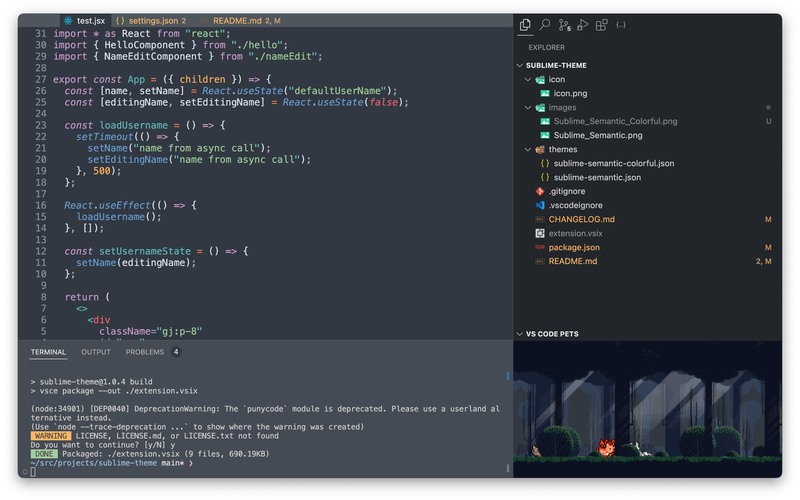

# Sublime Mariana Theme for VSCode




## Recommended settings

```jsonc
// .vscode/settings.json
{
  "editor.semanticHighlighting.enabled": true,
  "editor.fontSize": 14,
  "editor.lineHeight": 17,
  "editor.fontFamily": "Menlo"
}
```
