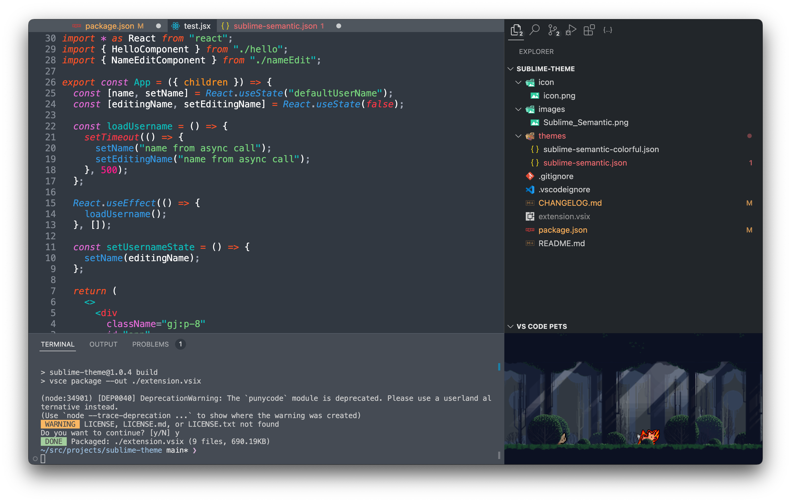

# Sublime Mariana Theme for VSCode

[](https://marketplace.visualstudio.com/items?itemName=duttdutt.sublime-theme)

### Sulbime Text 4 ⎯ Mariana


### Sublime Text 4 ⎯ Mariana Colorful



## Recommended settings

```jsonc
// .vscode/settings.json
{
	"editor.semanticHighlighting.enabled": true,
	"editor.fontSize": 14,
	"editor.lineHeight": 17,
	"editor.fontFamily": "Menlo"
}
```
